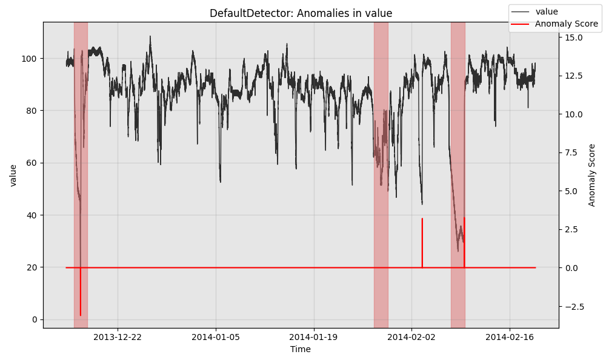
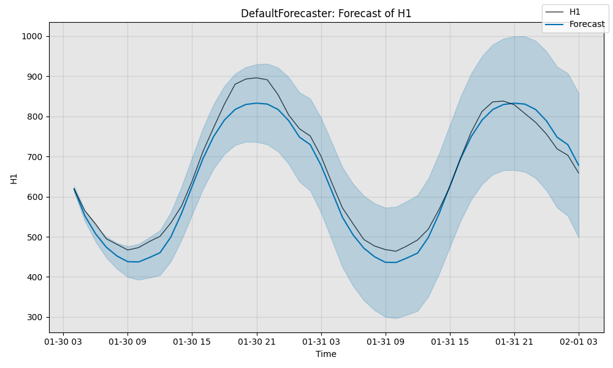

# Merlion

## Table of Contents
1. [Introduction](#introduction)
1. [Installation](#installation)
1. [Documentation](#documentation)
1. [Getting Started](#getting-started)
    1. [Anomaly Detection](#anomaly-detection)
    1. [Forecasting](#forecasting)
1. [Evaluation and Benchmarking](#evaluation-and-benchmarking)

## Introduction

Merlion is a Python library for time series intelligence. It provides an end-to-end machine 
learning framework that includes loading and transforming data, building and training models, 
post-processing model outputs, and evaluating model performance. It supports various time series 
learning tasks, including forecasting and anomaly detection for both univariate and multivariate 
time series. It also contains ensemble learning and autoML modules.

Key Features
- A library of models unified under a shared interface, including default options for a variety of common use cases
- Pre-processing layer implementing many standard data transformations
- Post-processing layer for anomaly detection, to ensure that anomaly scores are calibrated and to
  reduce the number of false alarms
- AutoML for automated hyperparameter tuning and model selection 
- Native support for visualizing model predictions
- Evaluation frameworks for evaluating a model's performance for time series anomaly detection and forecasting
- Standardized data loading & benchmarking for a wide range of anomaly detection and forecasting datasets

Read the [Installation](#installation) section of this document to set up the repo, and check out the
[example Jupyter notebooks](examples) to get a practical overview of the repo's main features (follow the instructions
[here](examples/README.md) on how to navigate the examples.)

## Installation

Merlion consists of two sub-repos: `merlion`, which is a repo for time series analysis, focusing on
anomaly detection and forecasting, and `ts_datasets`, a repo which implements data loaders for multiple time
series datasets, which loads time series as ``pandas.DataFrame`` s with accompanying metadata.

You can install `merlion` from PyPI by calling ``pip install sfdc-merlion``. You may install from source by
cloning this repo, navigating to the root directory, and calling ``pip install [-e] merlion/``. We recommend
installing in editable mode (i.e. specifying ``-e``) so you can pull new changes & run them without having 
to reinstall the package. You may install additional dependencies for plotting & visualization via
``pip install sfdc-merlion[plot]``, or by calling ``pip install [-e] merlion/[plot]`` from the root directory of
this repo.

To install the data loading package `ts_datasets`, clone this repo, navigate to its root directory, and call
``pip install -e ts_datasets/``. Note that this package must be installed in editable mode if you don't want
to manually specify the root directory of every dataset when initializing its data loader.

Note the following external dependencies:

1. For Mac users who want to use the Light GBM Forecaster, please install
   [Homebrew](https://brew.sh/) and call ``brew install libomp`` so that the 
   OpenMP libary is available for the model.

2. `merlion`'s implementation of Random Cut Forest (a popular anomaly detection model from AWS, proposed by
   [Guha et al. 2016](http://proceedings.mlr.press/v48/guha16.pdf)) depends on having the Java Development Kit (JDK)
   installed. For Ubuntu, call ``sudo apt-get install openjdk-11-jdk``. For Mac OS, install
   [Homebrew](https://brew.sh/) and call ``brew tap adoptopenjdk/openjdk && brew install --cask adoptopenjdk11``.

## Documentation

For example code and an introduction to Merlion, see the Jupyter notebooks in [`examples`](examples).
and the guided walkthrough [`examples/README.MD`](examples/README.md). For detailed
API documentation,  navigate to the [`docs`](docs) directory and follow the  instructions in
[`docs/README.md`](docs/README.md). If you are interested in contributing to the repo, follow
the instructions in [`CONTRIBUTING.md`](CONTRIBUTING.md).

You can find a discussion on various evaluation metrics for time series anomaly detection in the technical report
(we favor revised point-adjusted metrics), and you can find performance benchmarks for Merlion's models and datasets
[here](results). TODO: link to technical report

## Getting Started
Here, we provide some minimal examples using Merlion default models, 
to help you get started with both anomaly detection and forecasting.

### Anomaly Detection
```python
from merlion.utils import TimeSeries
from ts_datasets.anomaly import NAB  # data loader for Numenta Anomaly Benchmark

# Data loader returns pandas DataFrames, which we convert to Merlion TimeSeries
time_series, metadata = NAB(subset="realKnownCause")[3]
train_data = TimeSeries.from_pd(time_series[metadata.trainval])
test_data = TimeSeries.from_pd(time_series[~metadata.trainval])
test_labels = TimeSeries.from_pd(metadata.anomaly[~metadata.trainval])

# Initialize the model, train it, and get its predictions on the test data
from merlion.models.defaults import DefaultDetectorConfig, DefaultDetector
model = DefaultDetector(DefaultDetectorConfig())
model.train(train_data=train_data)
test_pred = model.get_anomaly_label(time_series=test_data)

# Visualize the model's predictions
from merlion.plot import plot_anoms
import matplotlib.pyplot as plt
fig, ax = model.plot_anomaly(time_series=test_data)
plot_anoms(ax=ax, anomaly_labels=test_labels)
plt.show()
```

```python
# Evaluate the model's predictions quantitatively
from merlion.evaluate.anomaly import TSADMetric
p = TSADMetric.Precision.value(ground_truth=test_labels, predict=test_pred)
r = TSADMetric.Recall.value(ground_truth=test_labels, predict=test_pred)
f1 = TSADMetric.F1.value(ground_truth=test_labels, predict=test_pred)
mttd = TSADMetric.MeanTimeToDetect.value(ground_truth=test_labels, predict=test_pred)
print(f"Precision: {p:.4f}, Recall: {r:.4f}, F1: {f1:.4f}\n"
      f"Mean Time To Detect: {mttd}")
```
```
Precision: 0.5000, Recall: 0.6667, F1: 0.5714
Mean Time To Detect: 1 days 10:27:30
```
### Forecasting
```python
from merlion.utils import TimeSeries
from ts_datasets.forecast import M4  # data loader for M4 data

# Data loader returns pandas DataFrames, which we convert to Merlion TimeSeries
time_series, metadata = M4(subset="Hourly")[0]
train_data = TimeSeries.from_pd(time_series[metadata.trainval])
test_data = TimeSeries.from_pd(time_series[~metadata.trainval])

# Initialize the model, train it, and get its predictions on the test data
from merlion.models.defaults import DefaultForecasterConfig, DefaultForecaster
model = DefaultForecaster(DefaultForecasterConfig())
model.train(train_data=train_data)
test_pred, test_err = model.forecast(time_stamps=test_data.time_stamps)

# Visualize the model's predictions
import matplotlib.pyplot as plt
fig, ax = model.plot_forecast(time_series=test_data, plot_forecast_uncertainty=True)
plt.show()
```

```python
# Evaluate the model's predictions quantitatively
from scipy.stats import norm
from merlion.evaluate.forecast import ForecastMetric

# Compute the sMAPE of the predictions (0 to 100, smaller is better)
smape = ForecastMetric.sMAPE.value(ground_truth=test_data, predict=test_pred)

# Compute the MSIS of the model's 95% confidence interval (0 to 100, smaller is better)
lb = TimeSeries.from_pd(test_pred.to_pd() + norm.ppf(0.025) * test_err.to_pd().values)
ub = TimeSeries.from_pd(test_pred.to_pd() + norm.ppf(0.975) * test_err.to_pd().values)
msis = ForecastMetric.MSIS.value(ground_truth=test_data, predict=test_pred,
                                 insample=train_data, lb=lb, ub=ub)
print(f"sMAPE: {smape:.4f}, MSIS: {msis:.4f}")

```
```
sMAPE: 6.2855, MSIS: 16.3387
```

## Evaluation and Benchmarking

One of Merlion's key features is an evaluation pipeline that simulates the live deployment
of a model on historical data. This enables you to compare models on the datasets relevant
to them, under the conditions that they may encounter in a production environment. Our
evaluation pipeline proceeds as follows:
1. Train an initial model on recent historical training data (designated as the training split of the time series)
1. At a regular interval (e.g. once per day), retrain the entire model on the most recent data. This can be either the
   entire history of the time series, or a more limited window (e.g. 4 weeks).
1. Obtain the model's predictions (anomaly scores or forecasts) for the time series values that occur between
   re-trainings. You may customize whether this should be done in batch (predicting all values at once),
   streaming (updating the model's internal state after each data point without fully re-training it),
   or some intermediate cadence.
1. Compare the model's predictions against the ground truth (labeled anomalies for anomaly detection, or the actual
   time series values for forecasting), and report quantitative evaluation metrics.

We provide scripts that allow you to use this pipeline to evaluate arbitrary models on arbitrary datasets.
For example, invoking
```shell script
python benchmark_anomaly.py --dataset NAB_realAWSCloudwatch --model IsolationForest --retrain_freq 1d
``` 
will evaluate the anomaly detection performance of the `IsolationForest` (retrained once a day) on the
"realAWSCloudwatch" subset of the NAB dataset.  Similarly, invoking
```shell script
python benchmark_forecast.py --dataset M4_Hourly --model ETS
```
will evaluate the batch forecasting performance (i.e. no retraining) of `ETS` on the "Hourly" subset of the M4 dataset.
