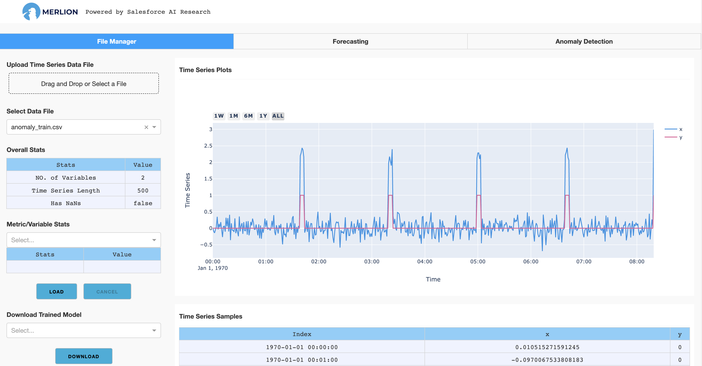
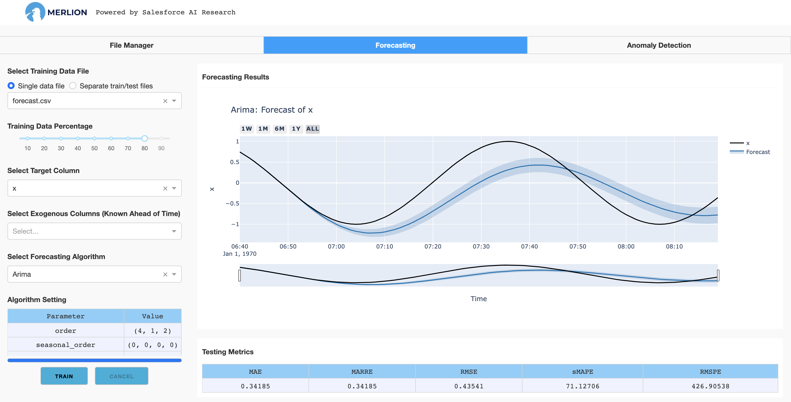
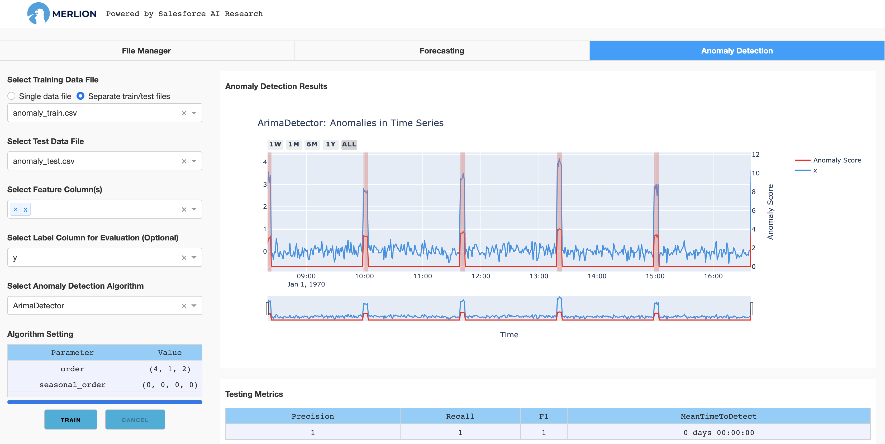

merlion.dashboard package
=========================

This package includes a GUI dashboard app for Merlion, providing a convenient way to train
and test a time series forecasting or anomaly detection model supported in Merlion. To launch
the dashboard app, type the following command:

.. code-block:: bash

    python -m merlion.dashboard

It will launch a Dash app on http://localhost:8050/ by default. After opening the link, the app
will create a folder `merlion` in your home directory. This folder includes the datasets you want to
analyze or train a model with (in the `data` folder), and the trained models for time series
forecasting or anomaly detection (in the `models` folder).

The app has three tabs. The first one is called "file manager" in which you can upload your datasets
(the datasets will be stored in `~/merlion/data`), check basic statistics of the datasets, visualize
the time series data, or download a particular trained model:

You can click `Drag and Drop` to upload the file to the `merlion` folder (our app is designed to support
docker deployment, so it doesn't allow to open a local file directly). If you use the app on a local
machine, you can also copy the data to `~/merlion/data` directly. The supported data file is in
the csv format, where the first column should be either Unix timestamps in unit ms or datetimes in a
string format (e.g., "1970-01-01 00:00:00"). The other columns are the metrics/variables.

Clicking the load button will load the dataset and show the time series figure on the right hand side.
It will also show some basic statistics, e.g., time series length, mean/std for each variable.
If there are trained models, you can select the model you want to download and click the download
button. The model and its configuration file will be compressed into a zip file.

The second tab is used to train a time series forecasting model supported in Merlion:

The app provides
full supports for these models where you can choose different algorithms and set particular parameters
as your need. To train a model, you need:

- **Select the dataset**: You can select a single training dataset if there is no test dataset, and then choose
  a train/test split fraction for splitting this dataset into training and test dataset for evaluation.
  If you have the test dataset, you can choose `Separate train/test files` and select the test dataset,
  and then the model will be trained with the training dataset and evaluated with the separate test dataset.
- **Set the target column**: You need to set the target column for forecasting (required) and the exogenous
  columns for exogenous regression (optional).
- **Select a forecasting algorithm**: Finally, you need to choose a forecasting algorithm such as
  Arima, AutoETS, and then set the training parameters if the default parameters do not work well.

The training procedure begins after clicking the train button. It may take some time to finish model
training. After the model is training, the model files will be saved in the folder `~/merlion/models/algorithm_name`.
The figure on the right hand side shows the forecasting results on the test dataset, and the tables
show the training and testing performance metrics.

The third tab is used to train a time series anomaly detection model:

How to train an anomaly detection model is similar as training a forecasting model, i.e.,

- **Select the dataset**: You can select a single training dataset if there is no test dataset, and then choose
  a train/test split fraction for splitting this dataset into training and test dataset for evaluation.
  If you have the test dataset, you can choose `Separate train/test files` and select the test dataset,
  and then the model will be trained with the training dataset and evaluated with the separate test dataset.
- **Set the feature columns**: Merlion supports both univariate time series anomaly detection as well
  as multivariate time series anomaly detection, so that you can choose one or multiple columns to
  train an anomaly detection model.
- **Set the label column**: If the dataset has a label column, you can set it for evaluation. Otherwise,
  ignore this setting.
- **Select an anomaly detection algorithm**: You need to choose an anomaly detection algorithm such as
  IsolationForest, and then set the training parameters if the default parameters do not work well.
- **Set threshold parameters**: You can also test different settings for the detection threshold to
  determine which value is better for your specific application.

The training procedure begins after clicking the train button, and the trained model is saved in the
folder `~/merlion/models/algorithm_name`. The figure on the right hand side shows the detection results
on the test dataset, and the tables show the training and testing performance metrics if you set the
label column.
